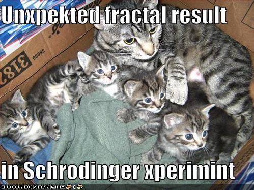

# Title of Your Document with an Image

"funny-pictures-cat-kittens-fractal-schrodinger-back" by the mad LOLscientist is licensed under CC BY 2.0. 

## Introduction

Write a brief introduction to introduce the topic and the image.

## Section 1: Exploring the Image

Describe the content of the image and its relevance to the topic.

## Section 2: Analysis

Provide an analysis of the image's significance, context, and any relevant details.

### Subsection 2.1: Visual Elements

Discuss specific visual elements within the image, such as colors, shapes, and composition.

### Subsection 2.2: Interpretation

Offer your interpretation of what the image represents or symbolizes in relation to the subject matter.

## Section 3: Comparisons

Compare the image with other relevant visuals, concepts, or examples.

## Conclusion

Summarize the insights gained from analyzing the image and its connection to the broader topic.

## References

List any sources, references, or citations, including the source of the image if applicable.
